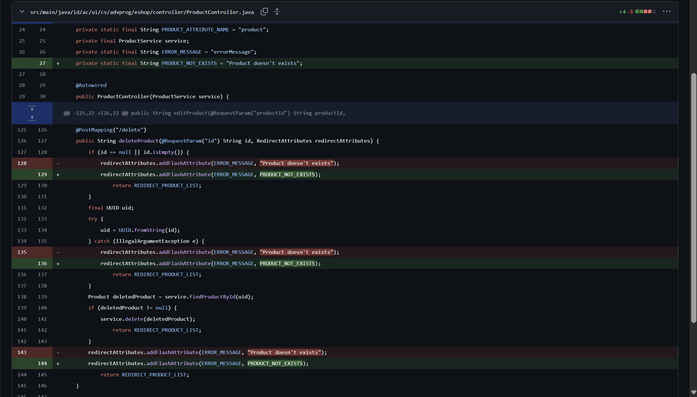
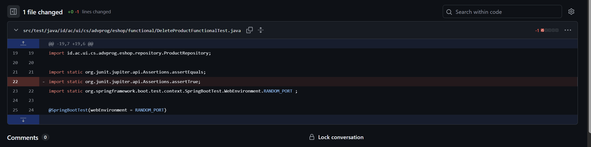
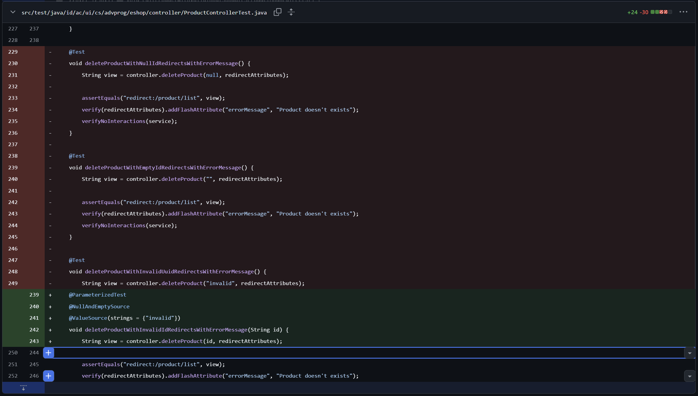
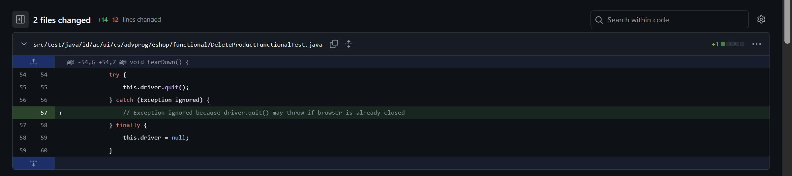
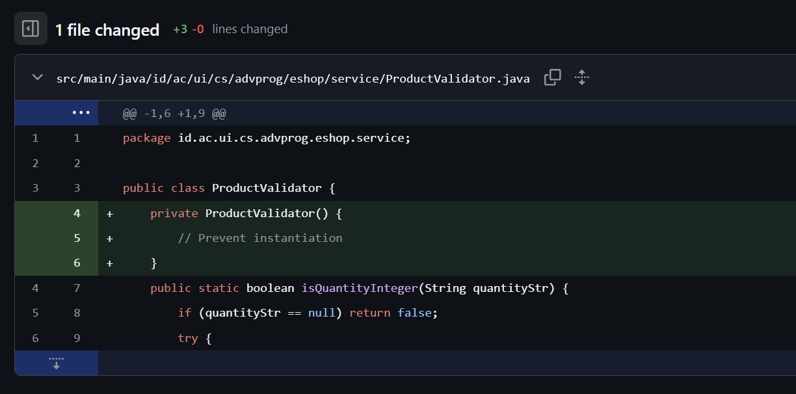
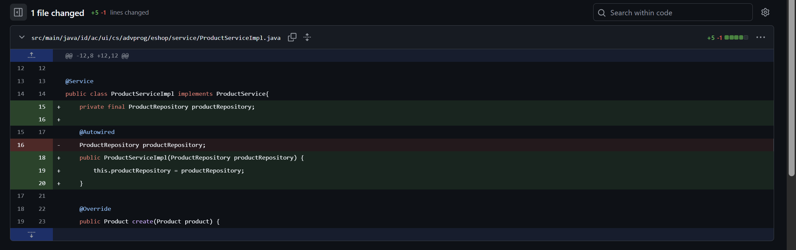
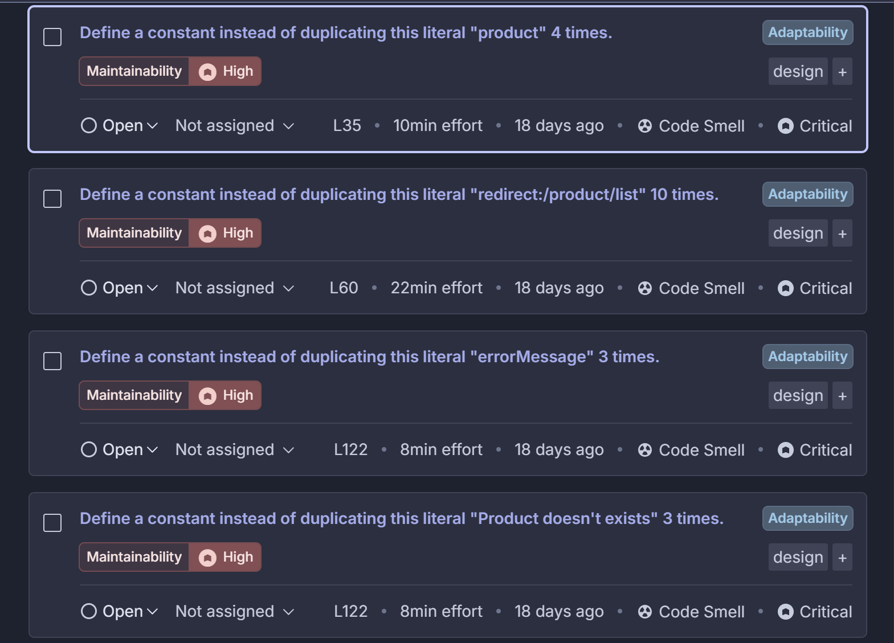

# Tutorial Adpro

 Modul-1-Coding-Standards 

## Reflection 1

My code uses clear descriptive variables and functions. For example, the function `isQuantityInteger` clearly shows that it is a function that will check whether or not the quantity is and integer. The return value of the function also matches the phrasing of the function. If it returns true, then the quantity is an integer, and vice versa. I've also implemented the DRY concept, especially on functional tests. For example when trying to test for creating a new product with various inputs, I created a template called `testInvalidCreateProductTemplate` which accepts a driver, the quantity , and the expected error message, that way, I don't have to rewrite the same code over and over again. I also added input validation for creating and updating products, specifically on the quantity field. The input validation checks that the quantity is an integer and that it is > 0. All the check is done in the server side and if a user inputs an invalid quantity, rather than the program crashing, it will display a notification to the user using red color.

## Reflection 2

1. 

The unit tests help me feel more certain that my program is working as expected. In general, one class should contain unit tests for 1 feature. We should test both positive and negative cases as well as any errors that might appear in the code. One metric to check if our testcase is enough is through code coverage. However, 100% code coverage doesnt mean our code is bug free because there might be some errors we forgot to handle. For example, if we make a division function but forget to handle division by zero and our testcase doesn't check for it, it will still have 100% code coverage.

2.  

If we repeat the exact same setup the code quality will reduce because we are not following the DRY principle. DRY principle states that we should not repeat our code, instead its better to package that code into a function then call that function whenever we need it. For unit tests, we could create a new java file which will contain the code and functions to setup the unit tests, then all future unit tests which will require that setup can just import the class and call the functions.

 Modul-2-CI-CD-Devops

## Reflection 1

1. List the code quality issue(s) that you fixed during the exercise and explain your strategy
on fixing them.

There are multiple issues identified in SonarQube, however I decided to fix only the high, medium, as well as unused imports issues

All of the high severity are string literal duplications. To fix it, I assign the string literal that is being duplicated to a variable and then call that variable whenever I need to use it. Here is an example: 

For unused imports, the fix is obvious, remove it

Next I refactored the `ProductControllerTest` from 3 seperate test cases to 1 parameterized testcase. For this I used `@ParameterizedTest`, ` @NullAndEmptySource`, and `@ValueSource`

Next on `DeleteProductFunctionalTest` and `UpdateProductFunctionalTest` there is a catch exception block that is empty. I added a comment explaining why it is empty

Next I added a private constructor to `ProductValidator` to prevent instantiation as it is a utility class

Lastly I removed feild injection and used constructor injection instead for `ProductServiceImpl` and `ProductController`

As we can see, after all the changes there are no more High and Medium severity issues

2. Look at your CI/CD workflows (GitHub)/pipelines (GitLab). Do you think the current
implementation has met the definition of Continuous Integration and Continuous
Deployment? Explain the reasons (minimum 3 sentences)!

Yes, I do think that my current implementation has met the definition of Continous Integration and Continous Deployment. The definition of Continous Integration is the practice were we automate the process of integrating changes by utilizing tools. Wheneve we want to integrate changes, we need to test the code first. My current workflow has automated 3 tests which will be activated everytime I push changes, OSSF Scorecard, unit tests, and sonarcloud for tests coverage. There is also a check for SonarQube Cloud code scan however it only applies to the master branch as I only have the free tier.

The definition of Continous Deployment is automating deployment after our code has past the tests defined in the CI workflow. My deploy script does exactly that, it checks for the status of all the workflows (sonar, ossf, and unit tests) and make sure that it all succeeds. If it doesnt, then the deploy job would be skipped. However if it all succeeds then it will automatically deploy the application to koyeb utilizing the koyeb cli.

For those reasons, I believe that my implementation has met the definition of CI/CD, although there are definitely some room for improvements, for example integrating functional tests to the workflow instead of only unit tests.

